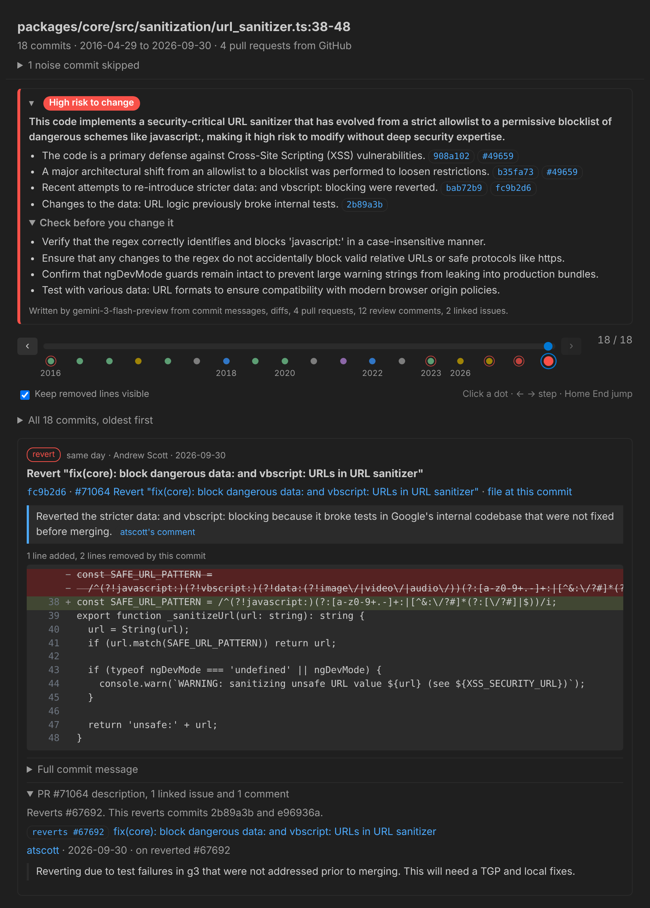
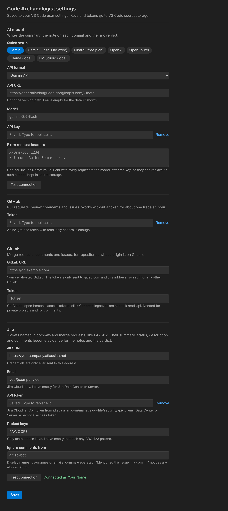

# Code Archaeologist

Select some lines in VS Code and ask **"Why is this here?"**. Code Archaeologist shows
how those lines evolved, commit by commit, so you can see what changed, when and why, with a
cited "safe to change?" verdict near the top.

## Contents

- [Screenshots](#screenshots)
- [Install](#install)
  - [Settings](#settings)
- [Status](#status)
- [Layout](#layout)
- [Develop](#develop)
- [CLI](#cli)
- [Context](#context)
  - [GitHub](#github)
  - [GitLab](#gitlab)
  - [Jira](#jira)
- [AI story](#ai-story)
- [Demo snippet](#demo-snippet)

## Screenshots

The panel on Angular's URL sanitizer (`url_sanitizer.ts` lines 38-48, the [demo snippet](#demo-snippet)),
on the latest commit: the 2026 revert of a stricter `data:` and `vbscript:` check. The file and
commit count stay pinned at the top, with the verdict and its cited reasons under them; clicking the
verdict's header row folds the reasons away. Under the slider, **All 18 commits, oldest first** opens
a list of every commit to jump to. The commit
card puts the author and date beside how long after the previous change it came, links the
commit, its pull request and the file at that commit on one line, then the AI note and the diff
with removed lines kept visible. Below the diff, dropdowns hold the full commit message, the pull
request's description, linked issues and comments, and each Jira ticket's description and comments.
Here the PR dropdown is open because the note rests on the reviewer's comment on the reverted PR.
The GitHub evidence comes from the test fixture in `packages/core/test/fixtures/github.ts`, abridged
from the public pull requests.



The settings screen (**Code Archaeologist: Open settings screen**), with the default Gemini provider, a
saved key and GitHub token, and Jira Cloud set up with **Test connection** passing. Keys, tokens and
extra headers are never shown.



## Install

No build needed. Download `code-archaeologist-<version>.vsix` from the
[latest release](https://github.com/aamandakoh/code-archaeologist/releases/latest), then either:

- in VS Code, open the command palette and run **Extensions: Install from VSIX…**, then pick the file, or
- from a terminal: `code --install-extension code-archaeologist-<version>.vsix`

Reload VS Code if asked. Select some lines in a file inside a git repository, right-click and choose
**Code Archaeologist: Why is this here?**. With the GitHub CLI you can also fetch the file from a terminal:
`gh release download --repo aamandakoh/code-archaeologist --pattern '*.vsix'`.

### Settings

Run **Code Archaeologist: Open settings screen** (or the gear on the panel) to set these. Keys and tokens
are kept in VS Code secret storage, and **Test connection** checks them before you save.

| Setting | Needed? | What it does |
| --- | --- | --- |
| LLM API key | **Must**, for the AI story | Without it you still get the commit-by-commit history, but no notes, summary or verdict. The default provider is Gemini: get a free key at [aistudio.google.com/apikey](https://aistudio.google.com/apikey). Also read from `GEMINI_API_KEY` or `OPENAI_API_KEY`. |
| Extra request headers | Optional | Headers sent with every LLM request, one `Name: value` per line, for a gateway or proxy that needs them. They can replace the API key's auth header and are kept in secret storage. CLI: `--header`. |
| Provider, API URL and model | Optional | Defaults to Gemini with `gemini-3.5-flash`. Pick **OpenAI-compatible** to use OpenAI, OpenRouter, or a local server like Ollama or LM Studio. That format needs a model id, and a local server usually needs no key. |
| GitHub token | **Should**, for GitHub repos | Lets the story cite PRs, review comments and linked issues. Without one GitHub allows only 60 requests an hour, and private repos can't be read. A fine-grained token with read access to pull requests and issues is enough. Also read from `GITHUB_TOKEN`. |
| GitLab token | **Should**, for GitLab repos | The same for merge requests, comments and issues. On GitLab, open **Personal access tokens**, click **Generate legacy token** and tick the `read_api` scope. Also read from `GITLAB_TOKEN`. |
| GitLab URL | **Must**, for self-hosted GitLab | Your GitLab's address, e.g. `https://gitlab.example.com`. The GitLab token is only sent to gitlab.com and this address. When a trace holds the token back, the panel has a button that sets this for you. |
| Jira URL | **Must**, to use Jira | Your Jira, e.g. `https://yourcompany.atlassian.net`. Ticket keys like `PAY-412` in commit messages and PR or MR titles and descriptions are read from here. |
| Jira email and API token | **Should**, for private Jira | Jira Cloud: your Atlassian email plus an API token from [id.atlassian.com](https://id.atlassian.com/manage-profile/security/api-tokens). Data Center or Server: leave the email empty and use a personal access token. Only ever sent to the Jira URL. Also read from `JIRA_EMAIL` and `JIRA_TOKEN`. |
| Jira project keys | Optional | Only match these keys, e.g. `PAY, CORE`. Empty matches any `ABC-123` except a few that are rarely tickets, like `UTF-8`. |

## Status

| Milestone | What it adds | State |
| --- | --- | --- |
| M0 | Workspaces, build, tests, extension skeleton | Done |
| M1 | `git log -L` trace, noise filter, CLI, raw history panel | Done |
| M2 | AI notes, summary and risk verdict (Gemini) | Done |
| M3 | GitHub PRs, review comments and issues (and GitLab merge requests, Jira tickets) | Done |
| M4 | Time-lapse UI polish | Done |
| M5 | Demo recording | Next |

## Layout

```
packages/
  core/       evidence engine: trace, parse, noise filter, AI story, cache. Never imports vscode.
  cli/        `archaeologist trace <file> <start> <end>`, same pipeline outside VS Code
  extension/  VS Code command and webview panel
```

## Develop

Needs Node 22+ and git.

```sh
npm install
npm run build        # all packages
npm test             # core unit and git integration tests
npm run typecheck
```

Run the extension: open this folder in VS Code and press **F5** ("Run extension"). In the new
window, open a file in any git repository, select some lines, right-click and choose
**Code Archaeologist: Why is this here?** (also in the command palette).

Build your own `.vsix` instead: `npm run package -w packages/extension` writes
`packages/extension/code-archaeologist-<version>.vsix`, which installs as above.

Cut a release: bump `version` in `packages/extension/package.json` and push to `main`. The
Release workflow builds the `.vsix` and publishes it as GitHub Release `v<version>`. It can also be
run by hand from the Actions tab, and skips versions that already have a release.

## CLI

```sh
npm run build
node packages/cli/dist/cli.js trace <file> <start> <end> [--json] [--snapshots] [--keep-noise] [--no-github] [--gitlab-url <url>] [--jira-url <url>] [--story] [--provider gemini|openai] [--base-url <url>] [--header "Name: value"] [--model <id>] [--cache-dir <dir>]
```

Lines are 1-based and inclusive, matched against HEAD. `--story` asks Gemini for the summary,
per-commit notes and verdict and needs `GEMINI_API_KEY`. When `origin` is on github.com, each
commit's pull request, review comments and linked issues are read too, with `GITHUB_TOKEN` if set
(`--no-github` skips this). `--jira-url` (or `JIRA_URL`) reads the Jira tickets they name, with
`JIRA_EMAIL` and `JIRA_TOKEN`. With `--cache-dir`, a rerun of the same lines at the same HEAD reuses
the trace, the GitHub responses and the story, so recording a demo never waits on the network.

## Context

Commit messages rarely say why. Code Archaeologist reads the "why" from where teams write it down:
pull requests and reviews on GitHub, merge requests on GitLab, and tickets in Jira. All of it goes
into the prompt with ids the story must cite, and the commit card links to it and folds the text
into dropdowns under the diff.

### GitHub

`packages/core/src/github.ts` reads, for each commit:

- **Pull request:** from the message when the merge tool wrote it (`(#123)` after the subject,
  Angular's `PR Close #123`, a merge commit), else GitHub's "pull requests for a commit"
  endpoint. Then its description (PR template boilerplate stripped), line comments on the traced
  file, review summaries and the conversation, bots left out.
- **Linked issues:** `Fixes #n`, `Closes #n`, `Resolves #n` in the commit or PR.
- **Reverts:** `Reverts #n` in the PR, or `This reverts commit <sha>` for a commit in the
  timeline. The comments on the reverted PR that mention the revert are attached to the revert,
  because that is usually where the reason is.

All of it goes into the prompt with citable ids (`pr:67692`, `review:fc9b2d6-1`, `issue:31462`).
The commit card links the PR on its links line, and its description, linked issues and comments
sit in a dropdown under the diff. Each PR costs four requests,
so the 18-commit demo trace makes about 60 the first time and none after that (responses are
cached for a week).

Without a token GitHub allows 60 requests an hour, about one trace. Use a fine-grained token with read-only access
to public repositories: **Code Archaeologist: Set GitHub token** in VS Code (kept in secret
storage), or `GITHUB_TOKEN` for the CLI. If GitHub fails (rate limit, bad token), the panel says
so and the story is written from what was found.

### GitLab

When `origin` is on GitLab, `packages/core/src/gitlab.ts` reads the same things from the GitLab
API instead: each commit's merge request (from "See merge request group/project!12" in a merge
commit, else GitLab's "merge requests for a commit"), its comments with line comments on the
traced file first, the issues it closes ("Closes #7") and the merge request a revert undid.
Merge requests show as `!12`. Remotes on gitlab.com or a host with "gitlab" in its name are found
on their own; for another self-hosted host set `codeArchaeologist.gitlabUrl` (CLI:
`--gitlab-url` or `GITLAB_URL`). Private projects, and comments even on public gitlab.com
projects, need a legacy personal access token with `read_api` (Personal access tokens > **Generate legacy token**): **Code Archaeologist: Set GitLab token**
in VS Code, or `GITLAB_TOKEN` for the CLI. The token is sent only to gitlab.com and to the GitLab
in `codeArchaeologist.gitlabUrl`, so a self-hosted GitLab needs that setting even when its name
has "gitlab" in it. Until it is set, the panel says the token was held back, with a
**Use my token on** button that sets it to that host.

### Jira

`packages/core/src/jira.ts` finds Jira keys like `PAY-412` in each commit message and in the
title and description of its pull request or merge request, then reads each ticket once from
the Jira REST API (`/rest/api/2/issue/<key>`): its summary, type, status, reporter, description
and comments, bots left out. Tickets go into the prompt as `jira:PAY-412`, so a note can say
"rounds per line, as the ticket's acceptance criteria say" and cite it. On the commit card the key
links to the ticket, its title on hover, and a dropdown under the diff holds the description and
comments.

Set the Jira URL on the settings screen (`codeArchaeologist.jiraUrl`, CLI: `--jira-url` or
`JIRA_URL`). Jira Cloud takes your Atlassian email (`codeArchaeologist.jiraEmail`, `JIRA_EMAIL`)
with an API token; Jira Data Center and Server take a personal access token alone. The token is
kept in secret storage (or `JIRA_TOKEN`) and only ever sent to the Jira URL. Without one, only
public tickets can be read. Keys like `UTF-8` or `SHA-256` are ignored; to match only your teams'
projects, set `codeArchaeologist.jiraProjects` (`JIRA_PROJECTS`) to e.g. `PAY, CORE`.
**Test connection** checks the URL and credentials and says who Jira takes you for.

## AI story

One Gemini call per trace (`packages/core/src/story.ts`), default model `gemini-3.5-flash` on
Google AI Studio's free tier:

- **Input:** the lines today, then per commit its id, date, author, message, its PR's title and
  description, up to 6 review comments, linked issues, Jira tickets with their last 4 comments and the diff of the traced lines (trimmed
  to 60 lines). Above 25 commits, or about 30k tokens, middle commits are
  sent as their subject line only.
- **Output:** JSON with a one-sentence summary, a note per commit and a low/medium/high verdict
  with 3 to 5 reasons and things to check, validated with zod.
- **Citations:** every note and reason must cite ids from the input (`commit:b35fa73`,
  `pr:49659`, `jira:PAY-412`). Citations that match nothing are dropped, and a claim left with none is shown as
  **unverified**. When the evidence gives no reason, the note says "No reason recorded."

In VS Code, **Code Archaeologist: Open settings screen** shows all of this as a form, with presets and
a connection test. The panel's Settings buttons, its gear and the extension's gear menu in the
Extensions view all open it. Or set the key with **Code Archaeologist: Set LLM API key** (kept in secret storage;
`GEMINI_API_KEY` in the environment also works) and the model with the `codeArchaeologist.model`
setting.

Gemini is only the default. `codeArchaeologist.baseUrl` (CLI: `--base-url`) points the story at
another API, and `codeArchaeologist.provider` set to `openai` (CLI: `--provider openai`) switches
to the OpenAI chat completions format, so OpenAI, OpenRouter, Ollama, LM Studio, vLLM or LiteLLM
all work. That format needs a model id, takes its key from the same command or `OPENAI_API_KEY`,
and needs no key for a server on your own `baseUrl`. If the server refuses a JSON schema the
client falls back to plain JSON mode. Without a key the panel shows the raw history and a button to add one. The free tier is
sometimes overloaded (HTTP 503); the client retries with backoff, and a full trace can take a
minute or two.

**Free options.** Each Gemini model has its own free daily quota, so when `gemini-3.5-flash`
runs out, `gemini-3.1-flash-lite` on the same key keeps going (the **Gemini Flash-Lite (free)**
preset). Off Google, Mistral's free Experiment plan (a verified phone number, no card) takes the
whole prompt of a long trace: OpenAI-compatible, `https://api.mistral.ai/v1`, model
`mistral-small-latest` (the **Mistral (free plan)** preset); requests on that plan may be used for
training. OpenRouter's `:free` models allow about 50 requests a day. Groq's free tier caps tokens
per minute below what a long trace sends, and a local Ollama model is free but slow on a laptop.

## Demo snippet

Angular's URL sanitizer has ten years of security history in eleven lines:

```sh
git clone --filter=blob:none https://github.com/angular/angular.git
node packages/cli/dist/cli.js trace angular/packages/core/src/sanitization/url_sanitizer.ts 38 48
```

That gives 18 commits from 2016 to 2026 (plus one lint re-format skipped as noise), ending
with the September 2026 revert of a stricter `data:`/`vbscript:` block.

Backup snippets in the same repo:

| File | Lines | Commits | Story |
| --- | --- | --- | --- |
| `packages/common/http/src/xsrf.ts` | 94-127 | 4 (+1 Prettier migration skipped) | 2025 fixes for XSRF tokens leaking to protocol-relative URLs |
| `packages/router/src/url_tree.ts` | 479-498 | 23 (+2 skipped) | `serialize()`, with several land/revert/reland cycles, the latest in September 2026 |

Line numbers are for angular/angular at `ff0dbf1` (2026-10-01).
